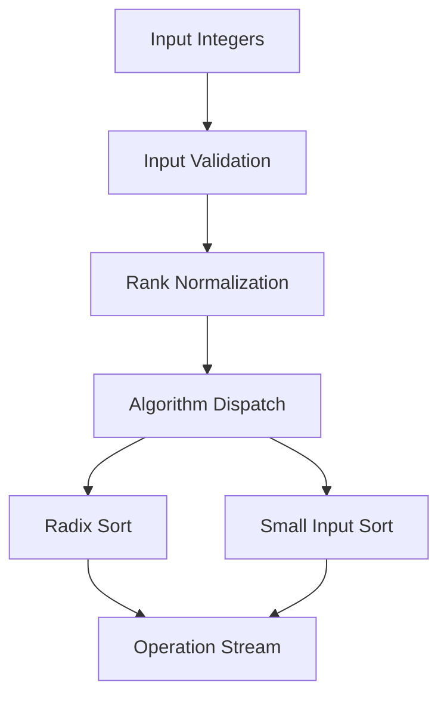

# Push Swap

> A constraint-based integer sorting engine implemented in C using dual-stack manipulation and a hybrid radix / insertion algorithm.

---

# Table of Contents


* [Overview](#overview)
* [Problem Constraints](#problem-constraints)
* [Algorithm Strategy](#algorithm-strategy)
* [Architecture](#architecture)
* [Radix Sort Implementation](#radix-sort-implementation)
* [Small Input Optimization](#small-input-optimization)
* [Performance](#performance)
* [Example](#example)
* [Engineering Notes](#engineering-notes)
* [License](#license)

---

# Overview

Push Swap is a constrained sorting problem where a sequence of integers must be sorted using **only two stacks** and a restricted set of stack operations.

Instead of returning the sorted values, the program outputs the **sequence of operations** required to transform the initial stack into a sorted one.

The allowed operations include swaps, pushes between stacks, and stack rotations:

```
sa sb ss
pa pb
ra rb rr
rra rrb rrr
```

Because elements cannot be accessed directly, traditional in-place sorting algorithms cannot be used directly. Every transformation must be expressed through stack manipulations.

This implementation solves the problem using a **hybrid approach**:

* **deterministic insertion strategy for very small inputs**
* **binary radix sort for larger datasets**

The goal is not only to sort correctly, but to **minimize the number of operations produced**.

---

# Problem Constraints

Push Swap imposes several structural constraints:

* Only **two stacks** may be used
* Elements can only be manipulated through the allowed operations
* There is **no random access to elements**
* The output must be a valid sequence of operations that sorts the stack

These constraints make many classical sorting algorithms inefficient, since comparisons and swaps must be translated into multiple stack operations.

Radix sort works well under these restrictions because it **does not rely on comparisons**, instead partitioning elements based on binary digits.

---

# Algorithm Strategy

The program uses two different sorting strategies depending on input size.

### Small inputs (≤5 elements)

Small inputs are sorted using a deterministic strategy based on known optimal permutations.

The algorithm:

1. Push elements to stack B until only three remain in stack A
2. Sort the three remaining elements with a minimal sequence of operations
3. Reinsert elements from stack B into their correct positions

Because the number of permutations for small sets is limited, this approach produces near-optimal operation sequences.

---

### Large inputs (>5 elements)

Larger inputs are sorted using **binary radix sort**.

Before sorting begins, the input values undergo **rank normalization**.

1. A sorted copy of the input values is created
2. Each value is replaced by its index in the sorted order
3. The resulting values form a dense range `[0, n-1]`

Example:

```
input:   40  -3  10  7
sorted:  -3   7  10  40
ranks:    3   0   2   1
```

This transformation removes gaps in the numeric domain and produces compact integers suitable for radix sorting.

The stacks therefore operate on **rank values rather than the original integers**.

---

# Architecture

The system follows a simple processing pipeline:

```
input
 │
 ▼
validation
 │
 ▼
rank normalization
 │
 ▼
algorithm dispatch
 │
 ▼
sorting engine
 │
 ▼
operation stream
```

Input validation ensures that all values are valid integers and that duplicates are rejected before sorting begins.

After normalization, the program selects the appropriate sorting strategy based on input size.

---

### Component Flow



---

# Radix Sort Implementation

For larger inputs the program performs **least-significant-digit binary radix sorting** using the two stacks.

For each bit position:

1. Inspect the top element of stack A
2. If the bit is **0**, push the element to stack B (`pb`)
3. If the bit is **1**, rotate stack A (`ra`)
4. Repeat until every element has been processed
5. Move all elements back from stack B to stack A (`pa`)

This process is repeated for each bit required to represent the largest rank value.

Because the ranks lie in `[0, n-1]`, the number of passes required is:

```
k = ceil(log2(n))
```

For example:

```
n = 500
log2(500) ≈ 9
```

The algorithm therefore performs approximately **9 passes over the dataset**.

The total operation complexity becomes:

```
O(n * log2(n))
```

Radix sort works particularly well for Push Swap because it avoids comparisons and relies only on **stable partitioning between the two stacks**.

---

# Small Input Optimization

For very small inputs radix sorting would generate unnecessary operations.

Instead the algorithm uses a targeted strategy:

1. Push elements from stack A to stack B until only three remain
2. Sort the three remaining elements using a minimal decision tree
3. Reinsert elements from stack B in sorted order

Because only six permutations exist for three elements, sorting them requires at most **three operations**.

This dramatically reduces operation counts for small inputs.

---

# Performance

Typical operation counts for this implementation:

| Input size | Operations |
| ---------- | ---------- |
| 3          | ≤ 3        |
| 5          | ≤ 12       |
| 100        | ~650–700   |
| 500        | ~5000–5500 |

These results fall within common Push Swap evaluation thresholds.

Because the radix algorithm scales linearly with the number of elements and logarithmically with the number of bits required to represent them, performance remains predictable even for larger datasets.

---

# Example

Running the program:

```
./push_swap 4 2 -7 1 3
```

Example output:

```
pb
pb
sa
pa
ra
pa
```

Each line represents a stack operation. Applying the operations to the initial stack results in a sorted configuration.

---

# Engineering Notes

Several implementation techniques are central to this project.

**Rank normalization**

Mapping values into a dense index space simplifies the sorting problem and allows efficient binary decomposition.

This technique is commonly used in algorithmic programming under the name **coordinate compression**.

---

**Algorithm–data structure compatibility**

Radix sort is typically implemented on arrays with random access. In this project it is adapted to operate on linked-list stacks using only push and rotation operations.

Maintaining stability across passes is critical for correctness.

---

**Constraint-driven algorithm design**

Every operation contributes to the final cost. The algorithm must therefore balance correctness with minimizing the generated instruction sequence.

Using two different strategies ensures that both small and large inputs are handled efficiently.

---

## License

This project was completed as part of the 42 School curriculum. It is intended for educational and portfolio purposes.

[Back to top](#push-swap)